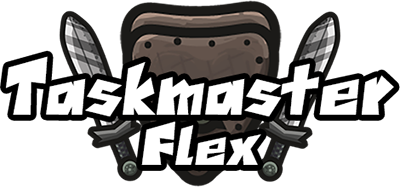
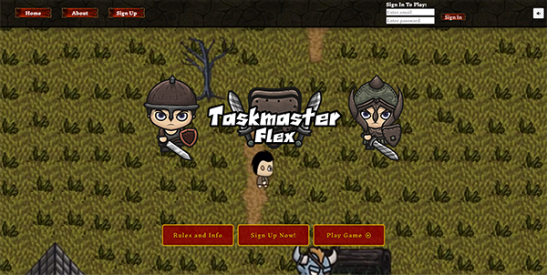
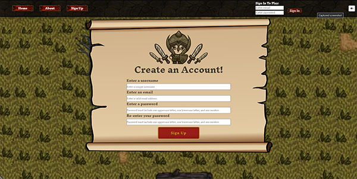
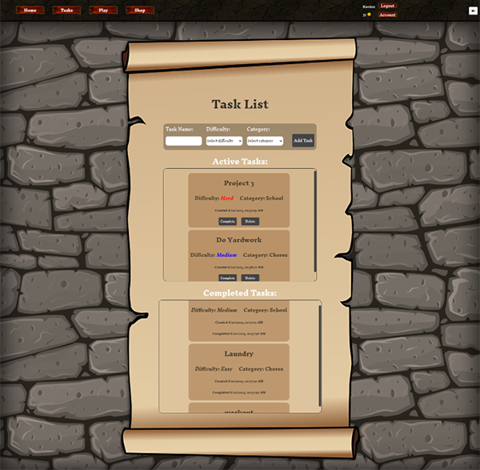
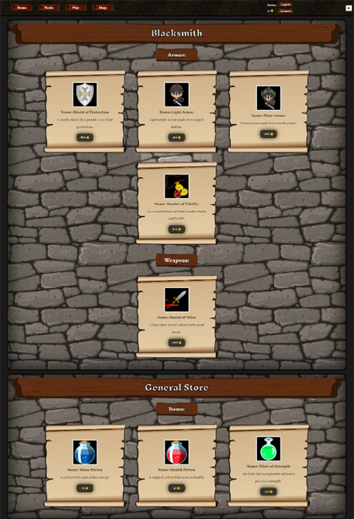
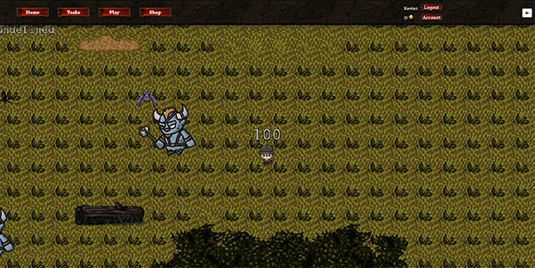

Many of us struggle with balancing time to be productive and leisure time. TaskMaster-Flex is a game that gives you the best of both worlds. While fun and challenging, TMF is rewarding in all the ways of your favorite dungeon crawlers, while incentivizing you to accomplish all of the tasks and goals you set for yourself each day.

## Description

### What was our motivation?
- Well, to put it simply, fun! Who doesn't love games? Everyone, from very young children, to the young at heart, to the not-so-young at heart love games of all kinds. From simple board games and basic "old-school" classics like Pong, to the massively advanced RPG's of today, to the mind controllers that are casino games, there are games for everyone!

### Why did we build this project?
- We thought "What if there were a game that you could play, where the advancement that you could make in the game was directly tied into how much progress you made on your daily tasks in real life?". It turns out that one already existed. We thought we might be able to improve upon that concept.

### What problems does it solve?
- Lack of motivation
- Task prioritization
- Building positive habits
- Combining work and play
- Increased accountability
- Stress relief and mental well-being

Overall, the app aims to address motivational challenges, improve task management and prioritization, bridge work and play, foster positive habits, increase accountability, and promote stress relief and mental well-being.

### What did we learn?
- How to more thoroughly incorporate multiple moving pieces of the JavaScript ecosystem.
- Game developement principles
  - Developing a game of this style involves understanding basic game mechanics, character progression, level design, and user interactions.
- Gamification of real-world tasks

## Table of Contents

- [Installation](#installation)
- [Usage](#usage)
- [Credits](#credits)
- [License](#license)

## Installation

No additional installation is required to use Taskmaster Flex.

## Usage

Deployed Link: https://taskmaster-flex-be1c20d82d58.herokuapp.com/ 

To use Taskmaster Flex, navigate to the deployed link and sign up to create an account.  Once you have registered, you can go to the Tasks page to add new tasks to your list.  Once you complete a task, you can mark it as 'complete' to move the task to Completed Tasks and receive your reward.  After you have earned enough gold, you can go to the Shop page to purchase items that will help make your character stronger.  Click on Game to access the game and begin playing.  You can move your character around the map with the arrow keys or WSAD keys.  You can click on the Account tab to view your current stats or change your account email or password.
  
  Home Page:

  

  Sign Up:

  

  Tasks Page:

  

  Shop Page:

  

  Game:

  
  

## Credits

1. The youtube video "React Website Tutorial - Beginner React JS Project Fully Responsive" by Brian Design inspired some component and css.  Here is a link to the [video](https://www.youtube.com/watch?v=I2UBjN5ER4s&t=5244s) 

2. The article 'Element size and scrolling' from javascript.info was used to learn about offset properties when calculating the desired scroll locations needed to scroll to a certain position with an onclick event. Here is a link to the [article](https://javascript.info/size-and-scroll) 

3. The article 'Element: scrollTo() method' from developer.mozilla.org was used to figure out how to use the offset properties to navigate up and down our page.  Here is a link to the [article](https://developer.mozilla.org/en-US/docs/Web/API/Element/scrollTo) 

4. We used the article "Loading Assets as Data URI in Phaser 3" to help figure out URI errors when rendering the bat spritesheet in Phaser.  Here is a link to the [article](https://supernapie.com/blog/loading-assets-as-data-uri-in-phaser-3/) 

5. We used this thread "Random Spawning" to learn how to randomly spawn multiple bat sprites.  Here is a link to the [page](https://phaser.discourse.group/t/random-spawning/3318/3) 

6. We used the github repo "Phaser Cheatsheet" to learn how to add physics to the bat sprites.  Here is a link to the [page](https://gist.github.com/woubuc/6ef002051aeef453a95b)

7. Augusta and Augusta font shadow used from Copyright (c) Typographer Mediengestaltung, 2000. All rights reserved. Full character set added by Dieter Steffmann, Kreuztal. Link to [page](https://www.1001fonts.com/augusta-font.html).

8. Special Thanks to the Man SuperTommy at Ourcade: https://www.youtube.com/@ourcadetv.

9. We found the way to customize the scroll bar look on our Task List containers from the Stack Overflow question "change scrollbar height" in an answer from the user "jilykate."  Here is a link to the [page](https://stackoverflow.com/questions/50817727/change-scrollbar-height)

10. We used React-Modal to create the modal on the Sign-Up form when a field is entered incorrectly.  Here is a link to the [documentation](https://www.npmjs.com/package/react-modal)

11. We used a tutorial written by Written by Denis Kratos
July 07, 2021 for support with charactr class setup.
[link here](https://shakuro.com/blog/phaser-js-a-step-by-step-tutorial-on-making-a-phaser-3-game#part-2)

## License

